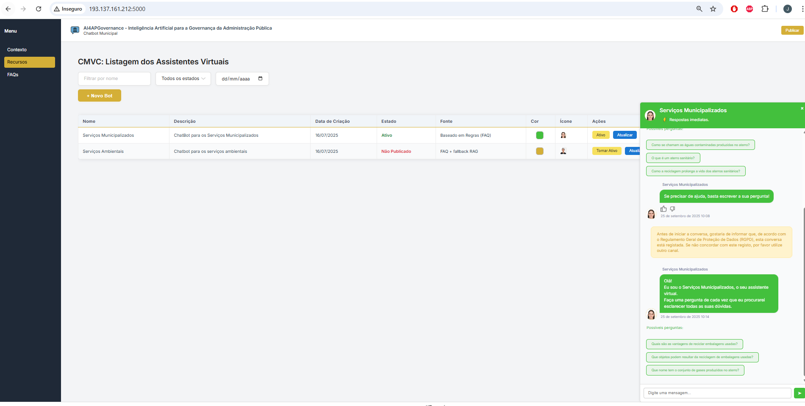
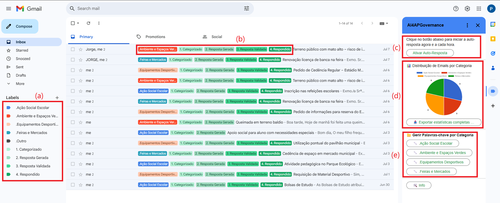
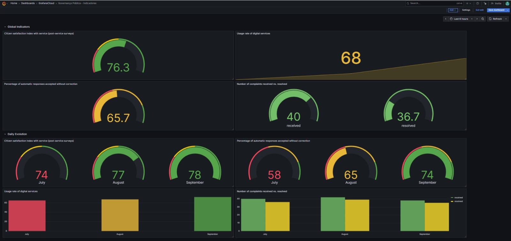
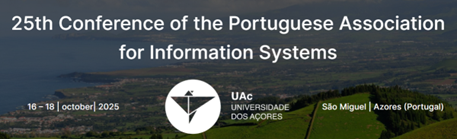

# AI4APGovernance - Artificial Intelligence for Public Administration Governance

## Abstract
Based on Artificial Intelligence (AI), Natural Language Processing, Generative AI and Data Science techniques the project aims to provide an interaction digital system with a interdisciplinary and citizen-centered perspective, as well as optimize administrative processes to promote and improve the strategic governance in Public Administration (PA) and help with digital transformation and automation processes, improving governmental operations, in particular in a municipal council for the benefit of society and citizens.
From a research perspective and real application at Public Administration, the grant's timing could not be more opportune. The world is on the cusp of a new era in Public Administration, one that is data-driven and AI-assisted. Therefore, the two specific objectives of the project will be materialized in two computational systems and will be focused on the strategic AI governance for PA, as well as on the optimization of processes and efficiency of email responses in the administrative services. The first objective will be materialized with the creation of an AI platform as a chatbot to citizens and administrative staff which can ask questions 24/7 and will always get an answer providing an automated conversation interface with the virtual staff in order to automate the municipality’s service scenarios for citizens and companies.Moreover, the historical data collected will be analyzed and explored with data science techniques, materialized with a web/mobile dashboard to classify, forecast and pattern analysis to extract knowledge for decision-makers to improve their strategic governance, implement established guidelines, execute the plans and control indicators and risks.
The second objective will be the creation of an AI plug-in to be incorporated in the email software for process optimization in administrative services to categorize, prioritize, summarize and propose responses to emails intelligently and with high accuracy and coherence. As an example, an AI plugin can automatically suggest a response to a citizen's email, improving response rates and administrative services. This project has the a Council City (Municipality) of the north of Portugal as a collaborating institution and the work plan demonstrates its involvement and commitment to the project as well as the high relevance and impact of the work program for this PA entity, particularly in its involvement in the tasks of the study, design, development and local simulation project, with promising results expected in the improvement of its strategic governance and prospects of its use in other PA entities, as required by the FCT call.
The project is in line with the FCT call objectives and will follow the European Commission (EU) guidelines and regulations on the responsible use on Generative AI in organizations, this project intents to promote, guide and support the responsible use of generative AI in research, monitoring actively the development and use of generative AI systems, integrate these guidelines into the general research guidelines for good research practices and ethics. We will use open-source software and Generative AI lawfully, ethically and responsibly and according to the AI European Act Regulations and Portuguese Regulations and Guideline. The data collected will be based on data protection and confidentiality defined by the European Regulations as a data management plan based on General Data Protection Regulation. The AGILE project management methodology will be used to develop the AI system platform and the Design Science Research methodology will be used as a research method. We consider this project as innovative, since it will focus on the strategic governance context of the decision-makers of a city council through an interface with citizens and, on the one hand, on optimizing procedures between citizens and the PA entity and on optimizing internal procedures in the categorization and generation of automatic response emails. Knowledge extraction using AI and data science techniques will complement the system by extracting patterns and knowledge for decision making support in the strategic governance context of a municipality.

--## Project Reference: 
--  - FCT: 2024.07434.IACDC - <a href="https://doi.org/10.54499/2024.07434.IACDC">AI4APGovernance</a>  
---

## Project Objectives
The project will deliver **two computational systems**:

1. **AI Platform for Strategic Governance**
   - A chatbot for citizens and administrative staff, available 24/7.  
   - Provides an automated conversation interface with virtual staff to support municipal service scenarios.  
   - Historical data will be analyzed with data science techniques, materialized in a **web/mobile dashboard** to:  
     - classify, forecast and pattern analysis  
     - support decision-making  
     - improve strategic governance  
     - implement guidelines and control indicators and risks  

2. **AI Email Add-On/Plugin for Process Optimization**
   - To be incorporated into email software for administrative services.  
   - Will **categorize, prioritize, summarize and propose responses** intelligently.  
   - Example: automatically suggesting a response to a citizen's email, improving response time and quality.  

---

## Collaboration
A **city council (municipality) of the north of Portugal** is a collaborating institution, actively involved in:  
- Study, design, and development of the project  
- Local simulation and testing  
- Ensuring relevance and impact for PA entities  

Expected results: improved **strategic governance** and potential replication in other public administration entities.  

---

## Compliance & Ethics
This project aligns with the **FCT call objectives** and follows **European Commission (EU) guidelines** for responsible use of Generative AI:  

- Promote, guide and support responsible use of Generative AI in research  
- Integrate guidelines into research practices and ethics  
- Use open-source software lawfully, ethically and responsibly  
- Comply with the **AI European Act** and **Portuguese regulations**  
- Data management based on **GDPR** (General Data Protection Regulation)  

---

## Methodology
- **Agile project management** for platform development  
- **Design Science Research** methodology for research work  
- **Knowledge extraction with AI & Data Science** to provide patterns and insights for strategic governance  

---

## Project Modules

### Module 1 – Chatbot
`/chatbot`  

  

---

### Module 2 – Email Add-On/Plugin
`/email-add-on`  

  

---

### Module 3 - Dashboard Implementation
`/dashboards`  

  

### Published Papers:
   

   ---

  

  

